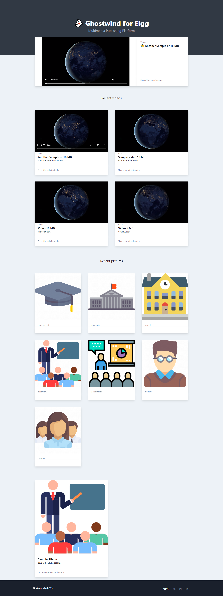

# Ghost Theme for Elgg 

### Requirements
 
* [Tidypics Plugin](https://elgg.org/plugins/385077)
* Files Plugin
* [Nubeso player](https://elgg.org/plugins/845298) 
* [Files Filter for Elgg (Optional)](https://elgg.org/plugins/1095821)

## Installation

* Enable the following plugins: Tidypics, Files, Nubeso Player
* Clone this repository: https://github.com/rjcalifornia/ghost-theme.git
* Place the theme at the end of the list, and activate it
 
 
 
